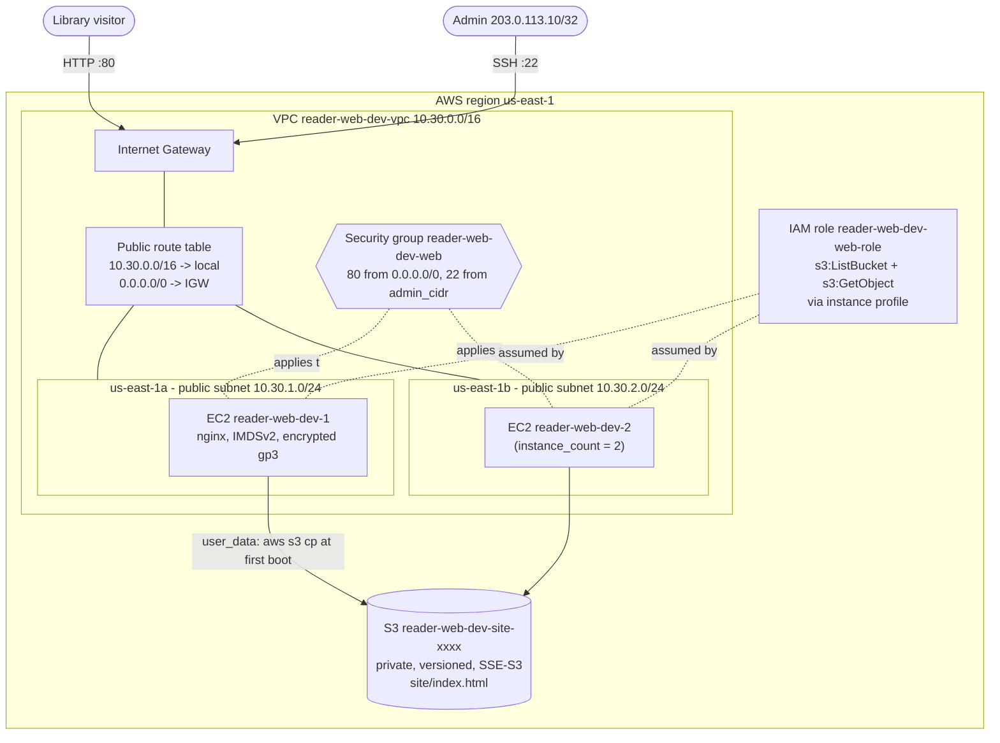
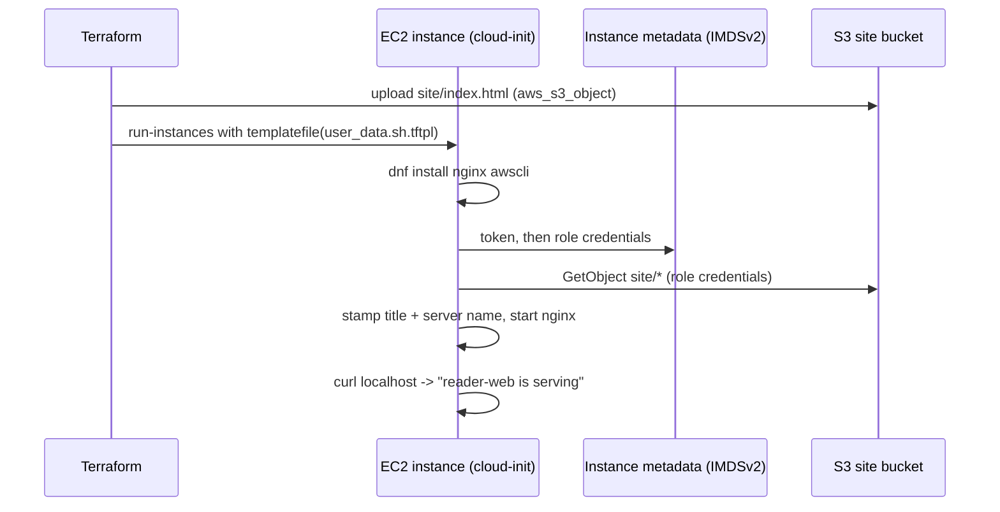
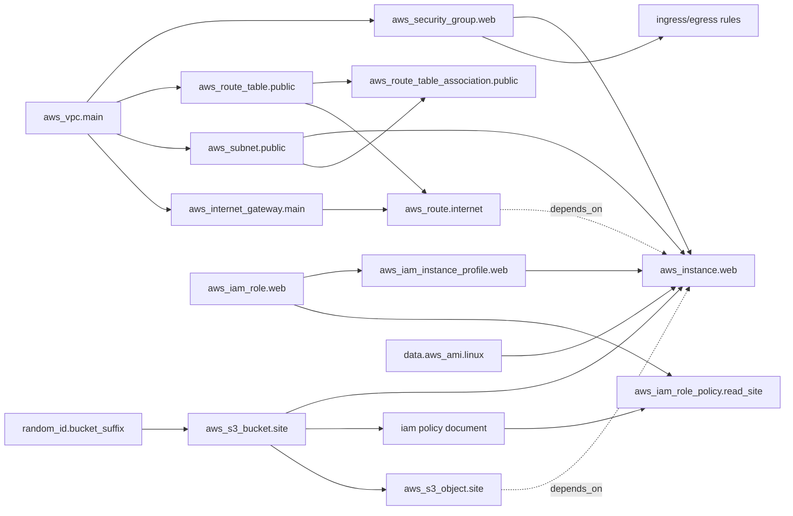

# reader-web architecture

## Infrastructure

```mermaid
flowchart TB
    user([Library visitor]) -->|HTTP :80| igw
    admin([Admin 203.0.113.10/32]) -->|SSH :22| igw

    subgraph aws["AWS region us-east-1"]
        subgraph vpc["VPC reader-web-dev-vpc 10.30.0.0/16"]
            igw[Internet Gateway]
            rt[Public route table<br/>10.30.0.0/16 -> local<br/>0.0.0.0/0 -> IGW]
            subgraph az1["us-east-1a - public subnet 10.30.1.0/24"]
                web1["EC2 reader-web-dev-1<br/>nginx, IMDSv2, encrypted gp3"]
            end
            subgraph az2["us-east-1b - public subnet 10.30.2.0/24"]
                web2["EC2 reader-web-dev-2<br/>(instance_count = 2)"]
            end
            sg{{Security group reader-web-dev-web<br/>80 from 0.0.0.0/0, 22 from admin_cidr}}
        end
        s3[("S3 reader-web-dev-site-xxxx<br/>private, versioned, SSE-S3<br/>site/index.html")]
        iam["IAM role reader-web-dev-web-role<br/>s3:ListBucket + s3:GetObject<br/>via instance profile"]
    end

    igw --- rt
    rt --- az1
    rt --- az2
    sg -.applies to.- web1
    sg -.applies to.- web2
    iam -.assumed by.- web1
    iam -.assumed by.- web2
    web1 -->|"user_data: aws s3 cp at first boot"| s3
    web2 --> s3
```

## Boot sequence

```mermaid
sequenceDiagram
    participant TF as Terraform
    participant EC2 as EC2 instance (cloud-init)
    participant IMDS as Instance metadata (IMDSv2)
    participant S3 as S3 site bucket
    TF->>S3: upload site/index.html (aws_s3_object)
    TF->>EC2: run-instances with templatefile(user_data.sh.tftpl)
    EC2->>EC2: dnf install nginx awscli
    EC2->>IMDS: token, then role credentials
    EC2->>S3: GetObject site/* (role credentials)
    EC2->>EC2: stamp title + server name, start nginx
    EC2->>EC2: curl localhost -> "reader-web is serving"
```

## Terraform dependency order (simplified from `terraform graph`)

```mermaid
flowchart LR
    vpc[aws_vpc.main] --> igw[aws_internet_gateway.main]
    vpc --> subnet[aws_subnet.public]
    vpc --> rt[aws_route_table.public]
    vpc --> sg[aws_security_group.web]
    igw --> route[aws_route.internet]
    rt --> route
    rt --> assoc[aws_route_table_association.public]
    subnet --> assoc
    sg --> rules[ingress/egress rules]
    rnd[random_id.bucket_suffix] --> bucket[aws_s3_bucket.site]
    bucket --> obj[aws_s3_object.site]
    bucket --> pol[iam policy document] --> rolepol[aws_iam_role_policy.read_site]
    role[aws_iam_role.web] --> rolepol
    role --> prof[aws_iam_instance_profile.web]
    ami[data.aws_ami.linux] --> ec2[aws_instance.web]
    subnet --> ec2
    sg --> ec2
    prof --> ec2
    bucket --> ec2
    obj -.depends_on.-> ec2
    route -.depends_on.-> ec2
```
